[](https://github.com/mvcb01/filmdepot/actions/workflows/ci.yaml)

# filmdepot

<!-- TABLE OF CONTENTS -->
## Table of Contents
<ol>
  <li>
    <a href="#about-the-project">About The Project</a>
  </li>
  <li>
    <a href="#getting-started">Getting Started</a>
    <ul>
      <li><a href="#prerequisites">Prerequisites</a></li>
      <li><a href="#installation">Installation</a></li>
    </ul>
  </li>
  <li>
    <a href="#usage">Usage</a>
    <ul>
      <li><a href="#visit-command">Visit command</a></li>
      <li><a href="#scanrips-command">ScanRips command</a></li>
      <li><a href="#link-command">Link command</a></li>
      <li><a href="#fetch-command">Fetch command</a></li>
      <li><a href="#scanmovies-command">ScanMovies command</a></li>
    </ul>
  </li>
  <li><a href="#license">License</a></li>
  <li><a href="#acknowledgments">Acknowledgments</a></li>
</ol>


<!-- ABOUT THE PROJECT -->
## About The Project

Simple CLI utility to interact with a local movie collection.

* parse your movie rips into Title, Release Date, rip quality and rip group
* search [The Movie Database API](https://developers.themoviedb.org/3/getting-started/introduction) and link movie rips to movies
* fetch genres, cast members, directors, keywords and IMDB ids
* show aggregated data related to the movies rips and the movies they are linked to
* keep track of changes over time

<p align="right">(<a href="#readme-top">back to top</a>)</p>

<!-- GETTING STARTED -->
## Getting Started

### Prerequisites

* Windows 10
* [sqlite3](https://www.sqlite.org/download.html)
* [.NET 6 SDK or above](https://dotnet.microsoft.com/en-us/download/dotnet/6.0). The .NET runtime is not sufficient since currently the only automated installation is building from source.

### Installation

1. Clone the repo
    ```powershell
    git clone https://github.com/mvcb01/filmdepot.git
    ```

2. Run the ps scripts in the `.\_DeploymentScripts` directory
    ```powershell
    cd .\_DeploymentScripts\
    .\1_DeployLocally.ps1
    .\2_GenerateMigrationScripts.ps1
    .\3_RunMigrationScripts.ps1
    ```

3. Save the contents of your `PATH` environment variable in a text file in your home directory
    ```powershell
    cd ~
    echo $env:PATH > PATH_backup.txt
    ```

4. Add the newly created app directory `C:\Users\<your-username>\filmdepot_PROD` to your `PATH` environment variable. Follow what's in [To add a path to the PATH environment variable](https://learn.microsoft.com/en-us/previous-versions/office/developer/sharepoint-2010/ee537574(v=office.14)). If you mess it up just restore `PATH` using the text file from the previous step.

5. Restart powershell and type this:
    ```powershell
    filmcrud --help
    ```
    You should see the main help menu:

    

6. [Get a key for The Movie Database API](https://developers.themoviedb.org/3/getting-started).

7. Edit the following configs in `C:\Users\<your-username>\filmdepot_PROD\appsettings.json`

    

<p align="right">(<a href="#readme-top">back to top</a>)</p>


<!-- USAGE EXAMPLES -->
## Usage

Use this like any other CLI:

```powershell
filmcrud <command> [<args>]
```

The `--help` option is available and will list all the available commands and options.

```powershell
filmcrud --help
filmcrud <command> --help
```

Note that some commands will call [The Movie Database API](https://developers.themoviedb.org/3/getting-started/introduction) several times. The following configs in `.\appsettings.json` define limits to the number of API calls per time unit and also the max retry count:

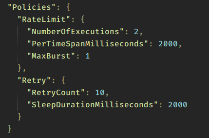

For more info see [Polly's](https://github.com/App-vNext/Polly) retry and rate limit policies.

Now some non-exhaustive examples of typical usage.

### Visit command

```
  --listcontents       generate the warehouse contents text file using the configured paths

  --persistcontents    read the warehouse contents textfile with the provided date and persist in repo

  --processmanual      process the manuallly configured movie rips for an existing visit; a visit date is expected

  -l, --listvisits     helper; list dates for all past visits

  --help               Display this help screen.

  --version            Display version information.
```

Start by listing the contents of the movie directory:

```powershell
filmcrud visit --listcontents
```

This will generate a file such as `.\whcontents\movies_YYYYMMDD.txt`, suffixed with the execution date.

Example:

`.\whcontents\movies_20230101.txt`
```text
Haxan.1922.720p.BluRay.x264-blackBeard
Nosferatu.1922.1080p.BluRay.x264-iSOMORFiSMO
```

`.\whcontents\movies_20230120.txt`
```text
Haxan.1922.1080p.BluRay.x264-beLLamy
Nosferatu.1922.1080p.BluRay.x264-iSOMORFiSMO
Finances.of.the.Grand.Duke.1924.1080p.BluRay.x264-iSOMORFiSMO
```

Persist such contents into the local database `.\FilmDb.db`:

```powershell
filmcrud visit --persistcontents 20230101
```

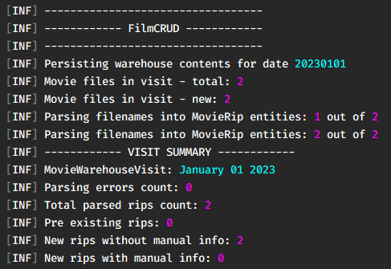

Each time these commands run a new **visit** will be created. You can then list all the existing visits:

```powershell
filmcrud visit --listvisits
```


### ScanRips command

Prints info about movie rips in existing visits.

```
  --countbyreleasedate    rip count by parsed release date for latest visit

  --withdates             list movies with parsed released dates YYYY

  --withgroup             list movies with parsed parsed release group

  --byvisit               rip count by visit

  --bygroup               rip count by release group

  --lastvisitdiff         movie rip difference from last two visits: added and removed movie rips

  --visitdiff             movie rip difference between two visits with dates YYYYMMDD: added and removed movie rips;
                          example: 20100101:20100102

  --search                search movie rip filenames by tokens; examples: "the.wicker.man.1973", "wicker man 1973"

  -l, --listvisits        helper; list dates for all visits

  -v, --visit             warehouse visit date (YYYYMMDD) to use as the scan target; defaults to the most recent
                          visit

  --help                  Display this help screen.

  --version               Display version information.
```

Example: search by tokens targeting the most recent visit.

```powershell
filmcrud scanrips --search nosferatu
```
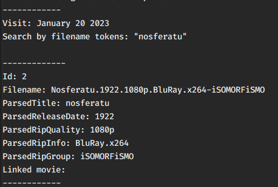

Example: movie rip count by release group targeting the most recent visit.

```powershell
filmcrud scanrips --bygroup
```

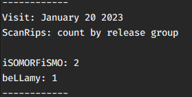

Example: movie rip count by release group targeting the 20230101 visit.

```powershell
filmcrud scanrips --bygroup --visit 20230101
```

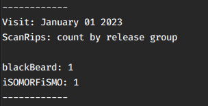

Example: movie rip difference between visits 20230120 and 20230101:

```powershell
filmcrud scanrips --visitdiff 20230120:20230101
```

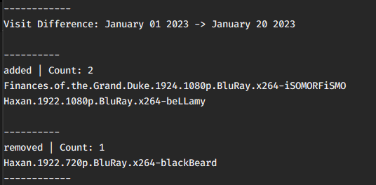


### Link command

Search [The Movie Database API](https://developers.themoviedb.org/3/getting-started/introduction) using the parsed movie names and release dates from existing visits.

```
  --search                  search locally and online

  --frommanualextids        link using the manually configured external ids

  --getunlinkedrips         get all movierips not linked to a movie

  --validatemanualextids    validate the manually configured external ids

  -m, --maxcalls            optional integer to limit the number of API calls

  --help                    Display this help screen.

  --version                 Display version information.
```

Example: search all unlinked movie rips

```powershell
filmcrud link --search
```


If certain searches have either no matches or several the details can be found in a file such as `.\logs\linking_errors_YYYYMMDD.txt`:

```
2023-03-25 18:26:25.451 [INF] ----------------------------------
2023-03-25 18:26:25.455 [INF] --- 25-Mar-23 18:26 ---
2023-03-25 18:26:25.455 [INF] ----------------------------------
2023-03-25 18:26:25.455 [ERR] LINKING ERROR: Finances.of.the.Grand.Duke.1924.1080p.BluRay.x264-iSOMORFiSMO: No search results for "finances of the grand duke" with release date in 1924, 1925, 1923
```

Such cases can be manually searched and the ids set in `.\appsettings.json`. Considering the example above:

[TMDB: The Finances of the Grand Duke (1924)](https://www.themoviedb.org/movie/55536-die-finanzen-des-gro-herzogs)

Note the movie id in the url:
ht<span>tps://ww<span>w.themoviedb.org/movie/<ins>**55536**</ins>-die-finanzen-des-gro-herzogs


These manual ids can be used and will override any previously existing links:

```powershell
filmcrud link --frommanualextids
```

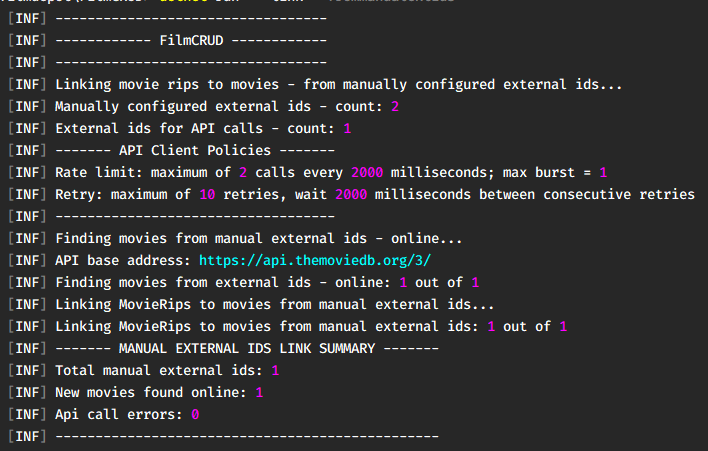

Note that it's possible to limit the number of searches, i.e., the number of calls to the TMDB API:

```powershell
filmcrud link --search --maxcalls 10
```

```powershell
filmcrud link --frommanualextids --maxcalls 10
```

### Fetch command

Once movie rips are linked to known movies it's possible to get additional details for these movies: **genres**, **cast members**, **directors**, **keywords** and **IMDB ids**.

```
  --genres          fetch genres for movies

  --castmembers     fetch cast members for movies

  --directors       fetch directors for movies

  --keywords        fetch keywords for movies

  --imdbids         fetch imdb ids for movies

  -m, --maxcalls    optional integer to limit the number of API calls

  --help            Display this help screen.

  --version         Display version information.
```

Example:

```powershell
filmcrud fetch --genres
```

```powershell
filmcrud fetch --directors
```

Again, with any of these options it's possible to limit the number of calls to the TMDB API,

```powershell
filmcrud fetch --genres --maxcalls 10
```

### ScanMovies command

Once movies are found and their details are fetched it's possible to get aggregated info.

```
  --withgenres       list movies with genres

  --withcast         list movies with cast members

  --withdirectors    list movies with directors

  --withdates        list movies with released dates

  --withkeywords     list movies with keywords

  --bygenre          get descending movie count by genre

  --bycastmember     get descending movie count by cast member

  --bydirector       get descending movie count by director

  --byreleasedate    get descending movie count by release date

  --search           search movies by title

  --lastvisitdiff    movie difference from last two visits

  --visitdiff        movie difference between two visits: added and removed; visit dates are expected; example:
                     20100101:20100102

  --listvisits       helper; list dates for all visits

  -v, --visit        warehouse visit date (YYYYMMDD) to use as the scan target; defaults to the most recent visit

  -t, --top          integer to limit output count of bygenre/bycastmember/bydirector and get only the top N

  --help             Display this help screen.

  --version          Display version information.
```

Example: search movie by title fuzzy matching
```powershell
filmcrud scanmovies --search "grand duke"
```


Example: movie count by genre targeting the latest visit
```powershell
filmcrud scanmovies --bygenre
```

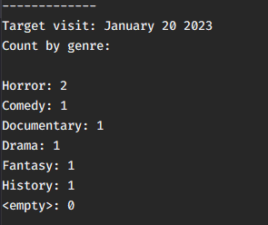

Example: movie count by genre targeting the 20230101 visit.
```powershell
filmcrud scanmovies --bygenre --visit 20230101
```
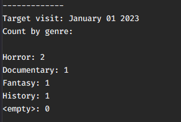

Example: movie count by cast member limited to the top 2
```powershell
filmcrud scanmovies --bycastmember --top 2
```

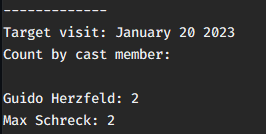

Example: search movies with the _castle_ keyword or the _folk_ keyword

```powershell
filmcrud scanmovies --withkeywords "castle" "folk"
```

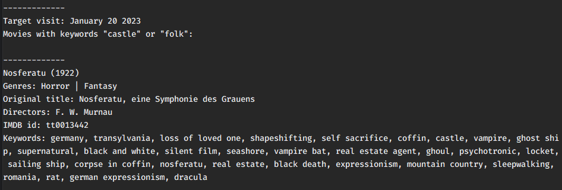

Example: movie difference between visits 20230120 and 20230101

```powershell
filmcrud scanmovies --visitdiff 20230120:20230101
```

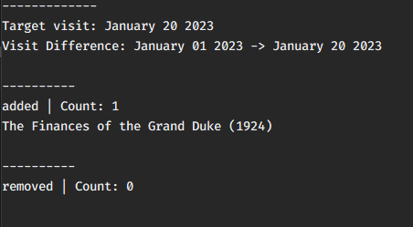


<p align="right">(<a href="#readme-top">back to top</a>)</p>

<!-- LICENSE -->
## License

Distributed under the MIT License. See [LICENSE](LICENSE) for more information.

<p align="right">(<a href="#readme-top">back to top</a>)</p>

<!-- ACKNOWLEDGMENTS -->
## Acknowledgments

* [The Movie Database API](https://developers.themoviedb.org/3/getting-started/introduction)

<p align="right">(<a href="#readme-top">back to top</a>)</p>